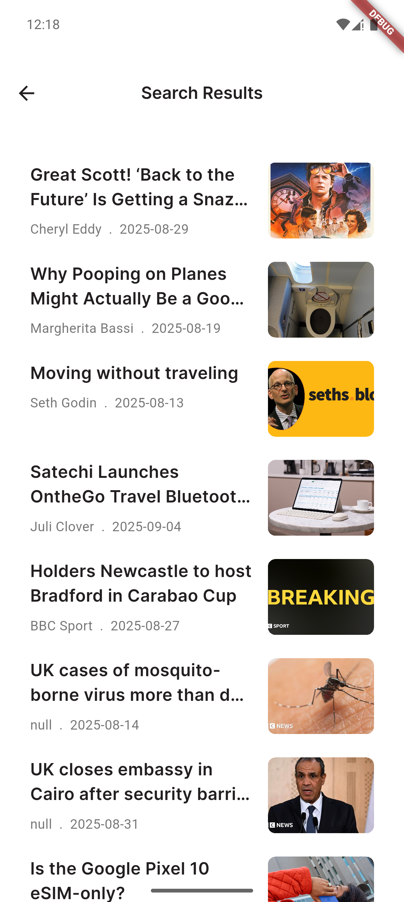

# 📰 News App

A clean and minimal **Flutter** News application.  
This app allows users to explore the latest articles and headlines in real-time using the [NewsAPI](https://newsapi.org/).  
It also supports **localization** so users can switch between **Arabic and English** seamlessly.  

---

## 🚀 Features
- 🗞️ Browse latest news across multiple categories  
- 🔍 Search for articles by keyword  
- 🌍 Multi-language support (Arabic & English) using Flutter Localization  
- 📱 Responsive and modern UI  
- 🔄 Pull-to-refresh for the newest headlines  
- ⚡ Fast performance with Dio HTTP client  

---

## 🛠️ Technologies Used
- **Flutter**  
- **Dart**  
- **Dio** (for API requests)  
- **NewsAPI** (news provider)  
- **Flutter Localization / intl** (multi-language support)  

---

## 📸 Screenshots

| 🏠 Home | 📄 Details | 🔎 Search |
|---------|------------|----------|
|  |  |  |

---

### 📌 Notes
This project was built for learning purposes with Flutter, NewsAPI, and localization support. It is not intended for commercial use.
